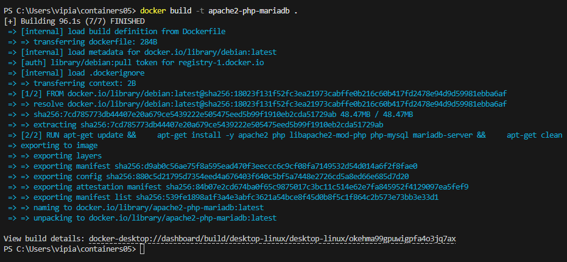
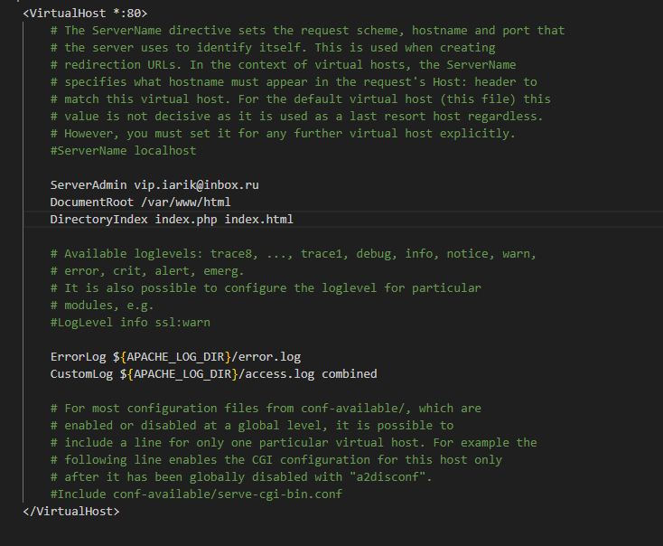

# Запуск сайта в контейнере

## Цель работы
Целью данной лабораторной работы является создание образа Docker для запуска веб-сайта на базе Apache HTTP Server, PHP (mod_php) и MariaDB. В процессе работы студент научится создавать Dockerfile, конфигурировать сервисы Apache, PHP и MariaDB, а также установить сайт WordPress и проверить его работоспособность.

## Задание
1. Создать Dockerfile для сборки образа контейнера, который будет содержать веб-сайт на базе Apache HTTP Server, PHP (mod_php) и MariaDB.
   - База данных MariaDB должна храниться в монтируемом томе.
   - Сервер должен быть доступен по порту 8000.
2. Установить сайт WordPress.
3. Проверить работоспособность сайта.

## Описание выполнения работы

# Шаг 1: Создание структуры проекта
- В папке `containers05` создаю подкаталоги для хранения конфигурационных файлов:
    - `files/apache2` — для конфигурации Apache.
    - `files/php` — для конфигурации PHP.
    - `files/mariadb` — для конфигурации MariaDB.
    - `files/supervisor` — для конфигурации Supervisor.

  
  
# Шаг 2: Написание Dockerfile
- Dockerfile создается с указанием установки Apache, PHP и MariaDB, а также конфигурации Supervisor для управления процессами.

FROM debian:latest

RUN apt-get update && \
    apt-get install -y apache2 php libapache2-mod-php php-mysql mariadb-server supervisor && \
    apt-get clean

VOLUME /var/lib/mysql
VOLUME /var/log

ADD https://wordpress.org/latest.tar.gz /var/www/html/

- COPY files/apache2/000-default.conf /etc/apache2/sites-available/000-default.conf
- COPY files/apache2/apache2.conf /etc/apache2/apache2.conf
- COPY files/php/php.ini /etc/php/8.2/apache2/php.ini
- COPY files/mariadb/50-server.cnf /etc/mysql/mariadb.conf.d/50-server.cnf
- COPY files/supervisor/supervisord.conf /etc/supervisor/supervisord.conf

RUN mkdir /var/run/mysqld && chown mysql:mysql /var/run/mysqld

EXPOSE 80

CMD ["/usr/bin/supervisord", "-n", "-c", "/etc/supervisor/conf.d/supervisord.conf"] 

# Шаг 3: Сборка и запуск контейнера
## Для сборки контейнера выполните команду:

- bash

docker build -t apache2-php-mariadb .

docker run -d -p 8000:80 --name apache2-php-mariadb apache2-php-mariadb

## Копирую из контейнера файлы конфигурации apache2, php, mariadb в папку files/ на компьютере.

## Остановите и удалите контейнер apache2-php-mariadb.

## Конфигурационный файл apache2.

## Конфигурационный файл php

### Настройте параметры memory_limit, upload_max_filesize, post_max_size и max_execution_time следующим образом:

- memory_limit = 128M
- upload_max_filesize = 128M
- post_max_size = 128M
- max_execution_time = 120

## Конфигурационный файл mariadb

## Создание скрипта запуска

## Создание Dockerfile

## Сбор образа контейнера и запуск 

# Шаг 4: Настройка базы данных
Внутри контейнера создается база данных и пользователь для WordPress:

- sql

CREATE DATABASE wordpress;
CREATE USER 'wordpress'@'localhost' IDENTIFIED BY 'wordpress';
GRANT ALL PRIVILEGES ON wordpress.* TO 'wordpress'@'localhost';
FLUSH PRIVILEGES;

# Шаг 5: Настройка WordPress
Перейдите в браузер по адресу http://localhost:8000/wordpress, чтобы завершить настройку WordPress. Указываю параметры подключения к базе данных в файле wp-config.php.

## Создание файла конфигурации WordPress

## Добавление файла конфигурации WordPress в Dockerfile

# Шаг 6: Проверка работоспособности сайта
После настройки базы данных и WordPress сайт должен работать.

# Ответы на вопросы
1. Какие файлы конфигурации были изменены?
- Apache: 000-default.conf, apache2.conf.
- PHP: php.ini.
- MariaDB: 50-server.cnf.
- Supervisor: supervisord.conf.

2. За что отвечает инструкция DirectoryIndex в файле конфигурации Apache?
Параметр DirectoryIndex указывает, какой файл будет загружаться по умолчанию, если не указан конкретный файл в URL.

3. Зачем нужен файл wp-config.php?
Этот файл необходим для настройки подключения WordPress к базе данных. В нем указываются параметры базы данных, такие как имя базы данных, имя пользователя, пароль и префикс таблиц.

4. За что отвечает параметр post_max_size в файле конфигурации PHP?
Параметр post_max_size ограничивает максимальный размер данных, которые могут быть отправлены через HTTP POST-запрос.

# Выводы
- В ходе выполнения лабораторной работы был создан контейнер с веб-сайтом WordPress, использующим Apache, PHP и MariaDB.
- Все компоненты были настроены корректно, и после выполнения шагов по настройке базы данных и подключения к WordPress, сайт успешно заработал. 
- Этот проект позволяет лучше понять работу с Docker и настройку веб-серверов в контейнерах.
